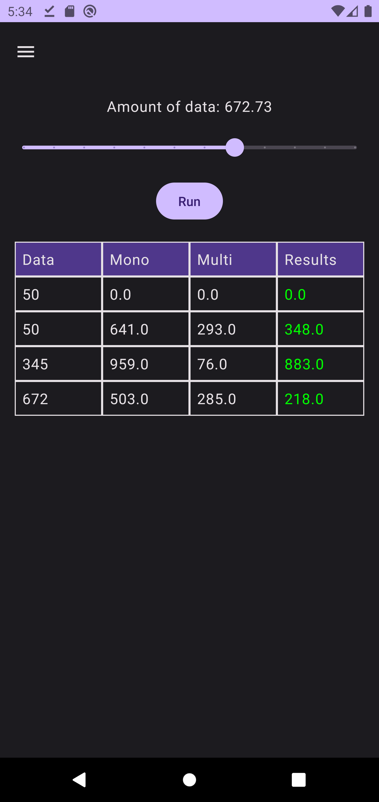

# Android Parallel Programming Educational App



## Overview

This Android application is designed for educational purposes to demonstrate how to handle parallel programming in Kotlin. It provides practical examples and explanations of parallel programming techniques that can be used in Android app development. Whether you're a beginner looking to learn the basics of parallel programming or an experienced developer seeking to enhance your skills, this app can serve as a valuable resource.

## Table of Contents

- [Features](#features)
- [Installation](#installation)
- [Usage](#usage)
- [Contribution](#contribution)
- [License](#license)
- [Contact](#contact)

## Features

- **Introduction to Parallel Programming**: Clear explanations of what parallel programming is and why it's important in modern Android development.

- **Parallel Programming Patterns**: Demonstrations of common parallel programming patterns such as multi-threading, coroutines, and parallel collections.

- **MVVM Architecture**: Built using the Model-View-ViewModel (MVVM) architecture, ensuring a clean and maintainable codebase with a clear separation of concerns between data, presentation, and user interface components.

- **Dependency Injection**: Dependency Injection using Dagger Hilt to promote code reusability and simplify the management of dependencies, allowing for efficient testing and flexibility in integrating new features.

## Installation

To get started with this educational app, follow these steps:

1. Clone this repository to your local machine:

   ```bash
   git clone https://github.com/ArturoTphx/parallel.git

## Usage

Follow the in-app tutorials and explore the provided code samples to learn more about parallel programming in Kotlin. Feel free to experiment with the code and adapt it for your own projects.

## Contribution

Contributions to this project are welcome! If you want to contribute:

1. Fork the repository.
2. Create a new branch for your feature or bug fix:

   ```bash 
   git checkout -b feature/your-feature
   
3. Make your changes and commit them:

   ```bash
   git commit -m "Add your feature or fix"
   
4. Push your changes to your fork: 
   
   ```bash
   git push origin feature/your-feature
   
5. Create a pull request to the main branch of this repository.

## License

This project is licensed under the MIT License.

## Contact

If you have any questions or suggestions, feel free to contact us:

- **José Arturo García Rodríguez**: arturotphx@gmail.com

